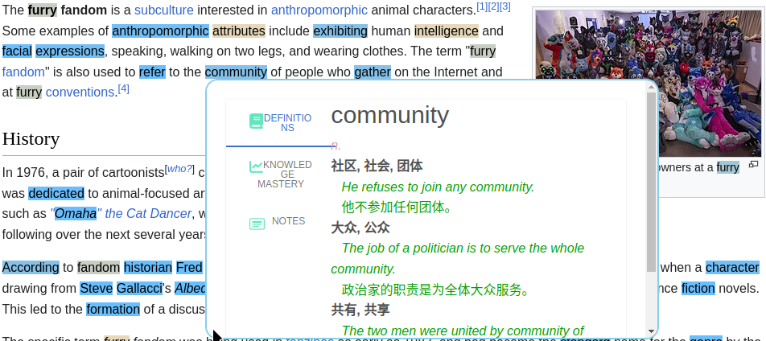
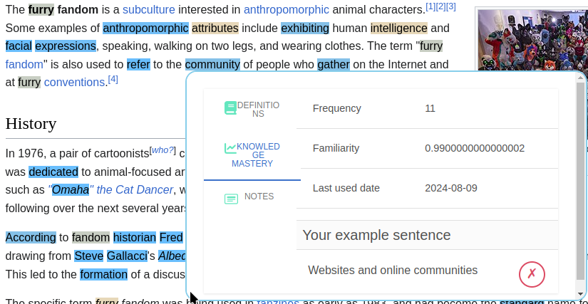
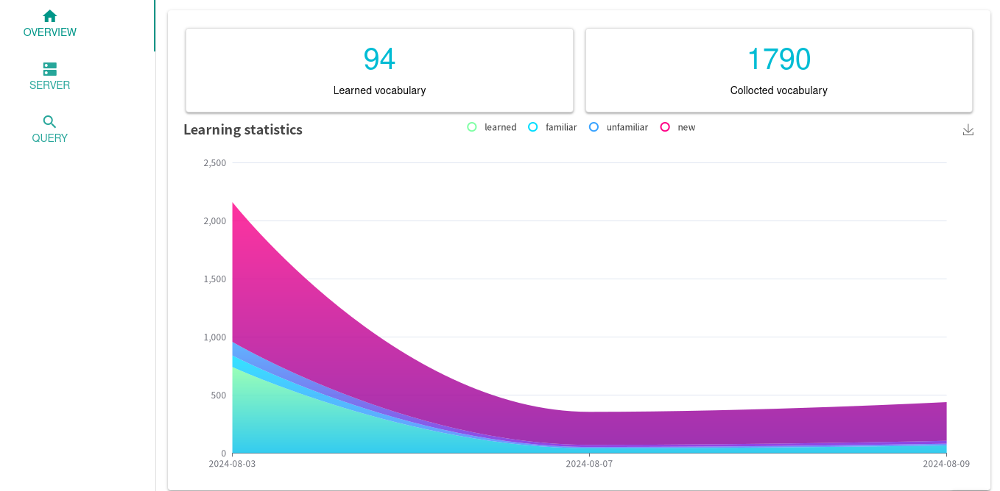
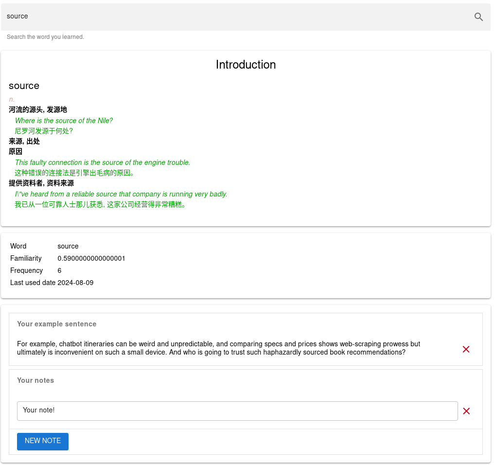

# Furry Language
Your language learning helper.
## Features
### Mark & record
Install our [web browser extension](https://github.com/ovo-Tim/FurLang_browser_plugin) and start learning effectively.
We will mark every words that you don't know by comparing to your own word database.
Also we will record every words you learn, including your learning progress.
Even taking notes of words can be done easily.

Check your learning progress in the browser:

### Overview your learning process
You can know your learning progress clearly in our application:

Also you can query your learned words:

## Plan
- View PDF file on the app.
- View videoes on the app.